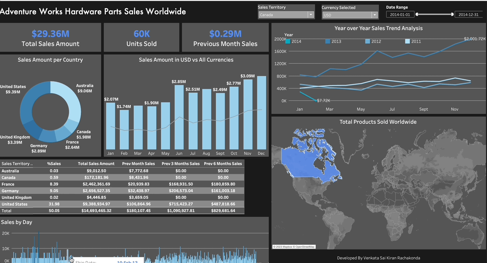

# Adventure Works Sales Dashboard

## Overview

This dashboard provides an in-depth look at the sales performance of Adventure Works across different metrics. It's designed to give insights into sales trends, performance across countries, and daily sales activities.

## Features

### Sales Amount vs All Currencies
- **Description**: This chart shows the total sales amount in different currencies.
- **Utility**: Useful for understanding the global sales distribution in various currencies.

### Year Over Year Sales
- **Description**: A line graph depicting the sales growth or decline year over year.
- **Utility**: Helps in analyzing the yearly growth trend of the company.

### Sales Amount Per Country
- **Description**: A world map highlighting sales volume in each country.
- **Utility**: Offers a geographical perspective of market penetration and performance.

### Sales by Day
- **Description**: A bar chart showing the sales figures for each day.
- **Utility**: Useful for identifying daily sales patterns and peak sales days.

### Total Products Sold Worldwide
- **Description**: A numeric display showing the total number of products sold globally.
- **Utility**: Provides an overall view of product popularity and sales volume.
